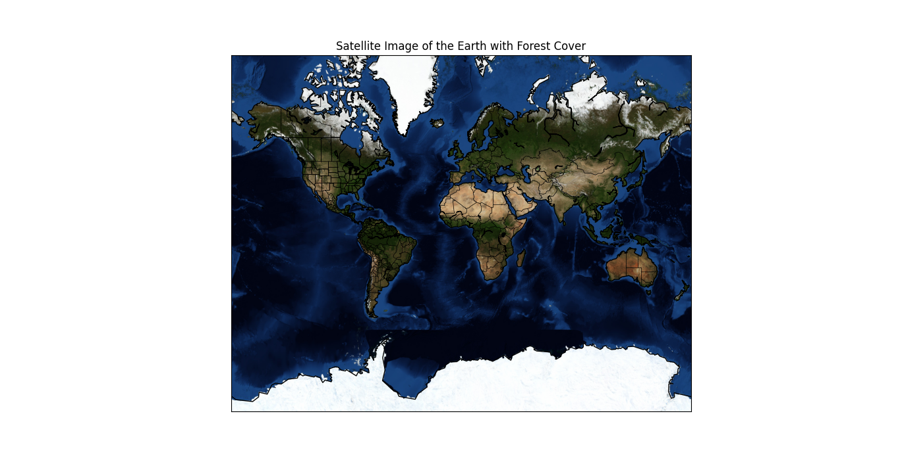

# EarthForests_AI

Creating an AI model to analyze satellite imergy and other remote sensing data to monitor deforestation, identify illegal logging activity, and asses the health of forest ecosystems.
https://github.com/infrawiki/infrawiki/wiki/Environmental-Protection-and-Development-Group--Gambia

https://github.com/mgkulik/researchdesigneR/wiki/Earthdata
Habitat Conversion/Fragmentation:
Deforestation
Reforestation/Revegetation
Urbanization/Urban Sprawl

Deep Learning Based 3D Point Cloud Regression for Estimating Forest Biomass
Paper PDF Link: http://arxiv.org/pdf/2112.11335v2
Abstract: Knowledge of forest biomass stocks and their development is important for
implementing effective climate change mitigation measures. It is needed for
studying the processes driving af-, re-, and deforestation and is a
prerequisite for carbon-accounting. Remote sensing using airborne LiDAR can be
used to measure vegetation biomass at large scale. We present deep learning
systems for predicting wood volume, above-ground biomass (AGB), and
subsequently carbon directly from 3D LiDAR point cloud data. We devise
different neural network architectures for point cloud regression and evaluate
them on remote sensing data of areas for which AGB estimates have been obtained
from field measurements in a national forest inventory. Our adaptation of
Minkowski convolutional neural networks for regression gave the best results.
The deep neural networks produced significantly more accurate wood volume, AGB,
and carbon estimates compared to state-of-the-art approaches operating on basic
statistics of the point clouds, and we expect this finding to have a strong
impact on LiDAR-based analyses of terrestrial ecosystem dynamics.

https://leaf-track.vercel.app/
LeafTrack is a remote sensing service that utilizes free, high-resolution satellite images to monitor the vegetation layer of a given area, such as a nature reserve. The service provides detailed information about the vegetation, including its health, growth, and distribution, through the use of advanced algorithms and machine learning models.
This information is then stored in a blockchain-based system, which ensures its immutability and transparency. The blockchain system also allows for secure and decentralized data sharing among relevant stakeholders, such as researchers and conservationists.
By leveraging this technology, LeafTrack acts as an early warning system for any changes in the vegetation layer, enabling reserve managers to make well-informed decisions in a timely manner. This can include identifying areas that require more attention or intervention, such as those affected by invasive species or climate change.
https://github.com/VishalPachpor/Leaf-Track.git"# EarthForests-AI" 
